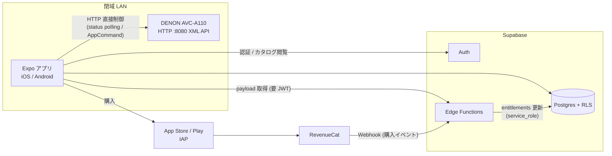

> avcon原本からの移植資料（歴史的記録）。原本コミット: `dd8dc8a5ea09ed03b7548bc931305ad324875d17`。当時の実機観測・仮説を含み、現在の全環境での保証ではありません。IP/MAC表記は伏せています。現実装との差分は [移植状況](migration-status.md) を参照してください。

# avcon プロダクト転換 技術プラン

**対象**: DENON AVC-A110 制御ツール avcon の「Raspberry Pi 常設 OSS サーバー」から「Expo ネイティブアプリ + Supabase 有償プリセット配信」への転換
**日付**: 2026-08-09
**ステータス**: ドラフト v2（初版に対し敵対的レビューを実施し、指摘 12 件を反映済み。§8 に反映一覧）

---

## 1. 全体アーキテクチャ

### 1.1 基本方針

- **Raspberry Pi 常設サーバーは廃止**。AVアンプ制御はスマホアプリから **閉域 LAN 内の AVC-A110 (port 8080, HTTP/XML) へ直接** 行う。中間サーバーは置かない。
- **OSS 部**: プロトコルクライアント（TypeScript 移植版 + 既存 Python）、基本コントロール UI。誰でも自分のアンプを無料で操作できる。
- **有償部**: 作品別チューニング済みプリセットの「中身」(payload)。カタログ（作品・版のメタデータ、プリセットの存在）は無料で閲覧可能にし、購入導線とする。

### 1.2 構成図



### 1.3 境界の要点

| 層 | 位置 | ライセンス | 内容 |
|---|---|---|---|
| プロトコルクライアント | アプリ内 (TS パッケージ) | OSS | AppCommand XML の組み立て/パース、getter/setter。現 `client.py` の移植 |
| 基本コントロール UI | アプリ内 | 要判断（§7-6） | 電源/音量/入力/サラウンド/チャンネルレベル。現 Web UI 相当 |
| プリセット適用エンジン | アプリ内 | OSS 可 | payload JSON → setter 群への割当 |
| プリセット payload | Supabase（Edge Function 経由でのみ取得） | 有償 | エンタイトルメント保持者のみ取得可、取得ログ + レート制限付き |
| チューニング採取ツール | Python (現行) | OSS | `snapshot.py` / `setupapi.py` を制作者側パイプラインとして継続利用 |

**収益防衛について正直な整理**（レビュー指摘反映）:

payload の実体はサラウンドモード + チャンネルレベル程度の数値であり、**適用した瞬間に無料の読み取り API（GetChLevel 等）とアンプ本体の表示から読み出せる**。つまり値の技術的秘匿は原理的に成立しない。DRM・難読化には一切投資しない。

moat（堀）は値の秘匿ではなく、以下に置く:

1. **検証済みカタログの規模と鮮度** — 新作・新版への継続追随、既存プリセットの継続改訂
2. **信頼** — 「この版はこの設定が正しい」という検証プロセスへの信頼
3. **体験の統合** — 作品を選んでワンタップで適用・復元できる導線

サーバー側の防衛（RLS + Edge Function ゲート）は「複製の防止」ではなく「**カタログ一括ダンプの摩擦とコストを上げる**」ことが目的である（§2.2）。

### 1.4 LAN 直接制御の前提条件（ネイティブ固有）

- **iOS**: ATS 例外 `NSAllowsLocalNetworking = true`（ローカル IP への平文 HTTP 許可）、`NSLocalNetworkUsageDescription` + iOS 14+ のローカルネットワーク許可ダイアログ対応。**初回起動で許可の意味を説明するオンボーディングを必ず挟む**（拒否されるとアプリの主機能が死ぬ）。
- **Android**: `networkSecurityConfig` でプライベートアドレス帯のみ cleartext 許可（全面 `usesCleartextTraffic=true` は避ける）。
- いずれも `expo-build-properties` で設定できるが **Expo Go では動かない → 開発初日から Dev Build (EAS) 前提**。IAP SDK も同様に Dev Build 必須なのでどのみち避けられない。
- アンプの発見: 初期リリースは **手動 IP 入力 + 前回接続先の記憶** で十分。SSDP/mDNS 自動発見は UDP ネイティブモジュールが要るため後回し（§6 Phase 4）。ただし **スタンバイ時の疎通可否は Phase 0 で必ず検証する**（§6 Phase 0 — 工程全体のゲート条件）。

---

## 2. Supabase 設計

### 2.1 スキーマ

設計の肝は 2 点。

1. **作品 (titles) と版 (editions) を分離**する。TENET の Apple TV 版と UHD BD DTS-HD 版は別レコードであり、プリセットは版に紐づく。
2. **プリセットのメタデータと payload をテーブル分割**する。「カタログは誰でも見える / 中身は買った人だけ」を表現するため `presets`（公開メタ）と `preset_payloads`（保護対象）を分ける。

改訂の運用（レビュー指摘反映）: **改訂は同一 preset 行の `version` インクリメント + payload 上書き**に単純化する。クライアントは `(preset_id, version)` でキャッシュを無効化する。履歴が必要になったら追記ログテーブルを後付けする。

```sql
-- ============ ユーザー ============
create table public.profiles (
  id           uuid primary key references auth.users(id) on delete cascade,
  display_name text,
  created_at   timestamptz not null default now()
);

-- ============ 作品メタデータ ============
create table public.titles (
  id             uuid primary key default gen_random_uuid(),
  canonical_name text not null,            -- 例: 'TENET テネット'
  original_name  text,                     -- 例: 'Tenet'
  release_year   int,
  director       text,
  tmdb_id        int unique,               -- 外部メタデータ連携用(任意)
  created_at     timestamptz not null default now()
);

-- 版: 配信/ディスク × 音声フォーマットの組み合わせ
create table public.editions (
  id           uuid primary key default gen_random_uuid(),
  title_id     uuid not null references public.titles(id) on delete cascade,
  medium       text not null check (medium in ('uhd_bd','bd','streaming','other')),
  service      text,                       -- 'apple_tv','netflix','amazon' / ディスクは null
  audio_format text not null,              -- 'dts_hd_ma_5.1','dolby_atmos','dd_plus_5.1' 等
  region       text,                       -- 'JP','US' 等(任意)
  notes        text,
  created_at   timestamptz not null default now(),
  unique (title_id, medium, service, audio_format)
);

-- ============ プリセット ============
-- カタログ側(公開メタデータ)。改訂 = 同一行の version++ + payload 上書き
create table public.presets (
  id           uuid primary key default gen_random_uuid(),
  edition_id   uuid not null references public.editions(id) on delete cascade,
  device_model text not null default 'AVC-A110', -- 将来の多機種対応キー
  version      int  not null default 1,
  is_free      boolean not null default false,   -- 無料サンプル(試用導線)
  status       text not null default 'draft'
               check (status in ('draft','published','archived')),
  summary      text,                             -- '重低音を抑えセリフ明瞭度優先' 等
  published_at timestamptz,
  updated_at   timestamptz not null default now(),
  unique (edition_id, device_model)
);

-- 中身(直接 SELECT 不可。Edge Function 経由でのみ取得 — §2.2)
create table public.preset_payloads (
  preset_id uuid primary key references public.presets(id) on delete cascade,
  payload   jsonb not null                       -- 形式は §4.3
);

-- ============ 商品 / エンタイトルメント ============
create table public.products (
  id       text primary key,                     -- RevenueCat の entitlement / product id と一致
  kind     text not null check (kind in ('subscription','title')),
  title_id uuid references public.titles(id)     -- kind='title'(買い切り)の対象。subscription は null
);

create table public.entitlements (
  user_id    uuid not null references auth.users(id) on delete cascade,
  product_id text not null references public.products(id),
  source     text not null check (source in ('app_store','play_store','promo')),
  expires_at timestamptz,                        -- null = 無期限(買い切り)。サブスクは期限あり
  revoked    boolean not null default false,     -- 返金/チャージバック時
  event_ts   timestamptz,                        -- 反映元イベントの発生時刻(巻き戻り防止 — §3.4)
  updated_at timestamptz not null default now(),
  primary key (user_id, product_id)
);

-- RevenueCat webhook の生ログ(監査・リプレイ用)
create table public.iap_events (
  id          bigint generated always as identity primary key,
  received_at timestamptz not null default now(),
  event_type  text,
  raw         jsonb not null
);

-- payload 取得ログ(一括ダンプ検知・レート制限 — §2.2)
create table public.payload_fetches (
  id         bigint generated always as identity primary key,
  user_id    uuid not null,
  preset_id  uuid not null,
  fetched_at timestamptz not null default now()
);
create index on public.payload_fetches (user_id, fetched_at);
```

> **運用ルール（スキーマ外の必須事項）**: `entitlements.user_id` は `auth.users` へ cascade 参照しているため、**「古い匿名ユーザーの定期削除」等の auth.users 掃除は entitlements を持つユーザーに対して行ってはならない**。そもそも購入前に本アカウント化を必須とする（§3.4）ため匿名ユーザーが entitlements を持つことはないが、防御的に削除ジョブ側で `not exists (select 1 from entitlements ...)` を条件に入れること。

### 2.2 RLS ポリシー

方針:

- **メタデータ (titles / editions / presets)**: published なプリセットに連なる行のみ、匿名含め全員 SELECT 可。**未公開ラインナップが親テーブル経由で列挙されないよう、titles / editions は EXISTS 条件で絞る**（レビュー指摘反映）。書き込みは service_role のみ（ポリシーを作らない = デフォルト拒否）。
- **preset_payloads**: **クライアントからの直接 SELECT は一切不可**。取得は Edge Function `get-preset-payload` 経由のみ（JWT 検証 → アクセス判定 → レート制限 → ログ → service_role で読み出し）。RLS だけの直接 SELECT 許可だと「1ヶ月サブスク加入 → 全行 SELECT → 即解約」の一括ダンプが最低価格で成立してしまうため（レビュー指摘反映）。
- **entitlements**: 本人のみ SELECT。書き込みは Edge Function (service_role) のみ。クライアントからの INSERT/UPDATE は絶対に許さない。
- **archived の意味**: カタログ非表示のみ。**購入済み・サブスク有効ユーザーのアクセスは archived でも維持**する（継続改訂という商品コンセプトと矛盾させない — レビュー指摘反映）。

```sql
alter table public.profiles        enable row level security;
alter table public.titles          enable row level security;
alter table public.editions        enable row level security;
alter table public.presets         enable row level security;
alter table public.preset_payloads enable row level security;  -- ポリシーなし = service_role 専用
alter table public.products        enable row level security;
alter table public.entitlements    enable row level security;
alter table public.iap_events      enable row level security;  -- ポリシーなし = service_role 専用
alter table public.payload_fetches enable row level security;  -- ポリシーなし = service_role 専用

-- 本人プロフィール
create policy "own profile" on public.profiles
  for all using (id = auth.uid()) with check (id = auth.uid());

-- カタログ: published プリセットに連なる行のみ公開
create policy "public read published" on public.presets
  for select using (status = 'published');

create policy "public read with published preset" on public.editions
  for select using (exists (
    select 1 from public.presets p
    where p.edition_id = editions.id and p.status = 'published'
  ));

create policy "public read with published preset" on public.titles
  for select using (exists (
    select 1 from public.editions ed
    join public.presets p on p.edition_id = ed.id
    where ed.title_id = titles.id and p.status = 'published'
  ));

create policy "public read" on public.products for select using (true);

-- 自分のエンタイトルメントのみ閲覧可
create policy "own entitlements" on public.entitlements
  for select using (user_id = auth.uid());

-- payload アクセス判定(Edge Function から呼ぶ。service_role 実行のため user_id は引数で受ける)
create or replace function public.has_preset_access(p_user_id uuid, p_preset_id uuid)
returns boolean
language sql stable security definer
set search_path = public
as $$
  select
    exists (  -- 無料プリセット(公開中のみ)
      select 1 from presets p
      where p.id = p_preset_id and p.status = 'published' and p.is_free
    )
    or exists (  -- サブスク or 該当作品の買い切り(archived でもアクセス維持)
      select 1
      from presets p
      join editions      ed on ed.id = p.edition_id
      join entitlements  e  on e.user_id = p_user_id
      join products      pr on pr.id = e.product_id
      where p.id = p_preset_id
        and p.status in ('published','archived')
        and not e.revoked
        and (e.expires_at is null or e.expires_at > now())
        and (pr.kind = 'subscription' or pr.title_id = ed.title_id)
    );
$$;
```

**Edge Function `get-preset-payload` の責務**:

1. JWT を検証しユーザー ID を得る（未認証は 401）
2. `has_preset_access(uid, preset_id)` で判定（不可なら 403）
3. レート制限: `payload_fetches` を参照し、例えば「直近 24h で 50 件超」なら 429 + 運営アラート（正常利用は一晩数件のはず。閾値は運用で調整）
4. `payload_fetches` に記録し、service_role で `preset_payloads` を読んで返す

### 2.3 Auth 方式

- **Supabase Auth** をそのまま使う。自前認証は作らない。
- プロバイダ: **Sign in with Apple**（iOS で他社ソーシャルログインを載せる場合の必須要件）+ **Google** + **メール Magic Link**。
- **匿名サインイン**はカタログ閲覧まで。**購入ボタン押下前に本アカウント化（Apple/Google サインイン）を必須とする**。匿名のまま購入させると、端末喪失・再インストール時に購入が孤児化し、Apple 必須のリストア機能が壊れる（レビュー指摘反映 — §3.4 も参照）。
- 制御系（AVR への HTTP）は LAN 内完結であり**認証と無関係**。インターネット断でもアンプ操作は常に動くこと（受け入れ条件は §6 Phase 1）。

---

## 3. 課金設計

### 3.1 制約の確認

アプリ内で解錠されるデジタルコンテンツ（プリセット）の販売は、**App Store Guideline 3.1.1 / Play の Billing ポリシーにより IAP が必須**。Stripe 等の外部決済をアプリ内購入フローに使うことはできない。

補足: EU DMA、および日本のスマホソフトウェア競争促進法（2025年12月施行）により外部リンク型決済の余地は広がりつつあるが、実装・審査・税務の複雑さに対して初期規模では割に合わない。**v1 は IAP 一本**とし、外部決済は将来の検討事項に留める（§7）。

**アンチステアリング注意**（レビュー指摘反映）: アプリ内から到達できる外部リンク（About → GitHub 等）の遷移先に Sponsors ボタンや支援・購入案内があると 3.1.1/3.1.3 違反と解釈される余地がある。審査前にアプリ内リンクの遷移先を精査し、リポジトリ側に課金導線を置かない（または in-app からのリンクを外す）。

### 3.2 選択肢比較

| 選択肢 | 内容 | 評価 |
|---|---|---|
| StoreKit 2 / Play Billing 直叩き + 自前レシート検証 | Edge Function で Apple/Google のサーバー API を叩き検証 | 検証・更新・返金・両ストア差異の実装コストが大きい。小規模には過剰 |
| **RevenueCat**（推奨） | RN SDK で購入、レシート検証・サブスク状態管理を委任、Supabase に同期 | 無料枠で開始可。両 OS 差異吸収。Supabase 連携の定番構成 |
| 外部決済 (Stripe / Web) | アプリ外で購入させる | v1 では規約・審査リスクに見合わない。見送り |

### 3.3 販売モデル

- **サブスクリプション（カタログ全作品アクセス）を主軸**に推奨。
  - 作品プリセットは継続追加・継続改訂される運営型コンテンツで、サブスクと相性がよい。エンタイトルメント判定も単純。§1.3 の moat 整理（複製は防げない → 鮮度と信頼で売る）とも整合する。
  - 買い切り（作品単位 non-consumable）は SKU 管理・ストア申請が作品数に比例して増えるため、需要が確認できてから `products.kind='title'` で追加する（スキーマは対応済み）。
- 無料枠: `is_free` プリセットを常時数本公開し、価値のデモとする。

### 3.4 エンタイトルメント同期（レビュー指摘を全面反映）

初版の「Webhook 一本鎖」は、購入直後に Webhook 未着で解錠されない・審査サンドボックスで即時解錠できずリジェクト、という欠陥があった。**同期経路を二重化し、真実源は自前の `entitlements` テーブルとする**。

1. **購入前**: 本アカウント化を必須（§2.3）。RevenueCat の `app_user_id` に **Supabase の user id** を設定（両システムの結合キー）。
2. **同期経路 A（主・即時）**: 購入完了コールバックでクライアント → Edge Function `sync-entitlements` → **RevenueCat REST API (`GET /subscribers/{app_user_id}`) へ照会**して現在の entitlement を取得し、service_role で `entitlements` を即時 upsert。購入直後・リストア直後・アプリ起動時に呼ぶ。
3. **同期経路 B（補助・網羅）**: RevenueCat Webhook → Edge Function。**認証は「設定した静的 Authorization ヘッダの照合」であり暗号署名ではない**（初版の「署名検証」は事実誤認）。したがって Webhook の内容は鵜呑みにせず、必要に応じ経路 A と同じく RevenueCat API へ照会して確定させる。`iap_events` に生ログを保存。
4. **巻き戻り防止**: upsert 時に `entitlements.event_ts` と受信イベントの timestamp を比較し、**古いイベントは無視**する（リトライ・順序逆転対策）。
5. **TRANSFER 処理**: 機種変更・再インストールで Apple ID リストアが走ると RevenueCat は TRANSFER イベントで entitlement を新 `app_user_id` へ移す。Webhook ハンドラで **旧 user_id の行を revoke し新 user_id へ付け替える**処理を必須実装とする。
6. **リコンシリエーション**: 日次ジョブ（pg_cron + Edge Function）で有効 entitlements を RevenueCat と突合し、差分を補正 + アラート。
7. **受け入れ条件（Phase 3）**: サンドボックスで「購入 → 数秒内に payload 取得可」「アンインストール → 再インストール → リストア → payload 取得可」の E2E テストが通ること。

---

## 4. Expo アプリ設計

### 4.1 二面構成

アプリは独立した 2 つの経路を持ち、**互いの障害が波及しない**ことを設計原則とする。

- **LAN 面（オフラインで完結）**: AVR への直接 HTTP。認証不要。インターネット不通でも全機能動作。
- **クラウド面**: Supabase（カタログ/認証/payload 取得）+ RevenueCat（購入）。不通時はキャッシュで縮退。

これを検証可能な要件に落とす（レビュー指摘反映）→ **Phase 1 受け入れ条件**: 「機内モード相当（LAN のみ、WAN 断）で起動 → アンプ制御画面到達まで 3 秒以内。クラウド初期化（Supabase セッションリフレッシュ、RevenueCat init、カタログ同期）はすべて非同期 + タイムアウト付きで、失敗してもコールドスタートをブロックしない」。E2E テストに含める。

### 4.2 モノレポ構成（案）

```
avcon/
  avcon/                  # 既存 Python(採取・制作ツールとして存続)
  packages/
    denon-client/         # OSS: client.py の TS 移植(fetch + fast-xml-parser)
                          #   _xml.py 相当の build/parse、models.py 相当の型、
                          #   getter/setter。React 非依存の純ロジック。モック実装込み
  app/                    # Expo アプリ(EAS Dev Build 前提)
    src/
      avr/                #   denon-client を使う接続管理・ポーリング hooks
                          #   (useStatus の楽観的更新 + holdPolling パターンを移植)
      catalog/            #   Supabase カタログ閲覧・検索
      presets/            #   payload 取得・キャッシュ・適用エンジン
      purchases/          #   RevenueCat 連携 (§3.4 の同期経路 A)
  web/                    # 既存 React UI(凍結、§5)
```

Python `client.py` の移植は素直に行う: `_get/_post_simple/_post_param` → `fetch` ラッパー、XML は `fast-xml-parser`、dataclass → TS interface。**サーバー (FastAPI) 層は移植しない** — アプリが直接アンプを叩くため中間 API は存在しない。

`mock.py` 相当のインメモリモックを denon-client に含める。これは実機なし開発だけでなく**ストア審査対応の要**でもある（レビュー指摘反映）: ハード連携アプリはレビュアーが実機操作できないと 2.1 (App Completeness) で差し戻されやすい。**アプリ内に審査用デモモード（モックアンプ接続）を同梱**し、審査ノートに起動手順を明記。デモモードで「接続 → 無料プリセット適用 → 購入 → 有償プリセット適用」まで一巡できること（Phase 3 受け入れ条件）。

### 4.3 プリセット payload と適用エンジン

```json
{
  "schema_version": 1,
  "device_model": "AVC-A110",
  "surround_mode": "DTS Neural:X",
  "channel_levels": { "FL": 0.0, "FR": 0.0, "C": 1.5, "SW": -2.0, "SL": 0.5, "SR": 0.5 },
  "notes": "UHD BD (DTS-HD MA 5.1)。LFE が過大なため SW -2.0dB、セリフ明瞭度で C +1.5dB。"
}
```

- **v1 の適用対象は現 Python client に setter が存在する範囲に限定**: サラウンドモード + チャンネルレベル（+必要なら音量/入力）。これだけでも「作品ごとの最適化」の中核価値は成立する。
- 適用エンジンは `schema_version` と既知キーのみ処理し、未知キーは無視（前方互換）。適用結果を `[OK]/[WARN]` でフィールド単位に報告し、部分失敗を許容する。
- Audyssey (DynEQ/RefLevel/DynVol) や tone control の書き込みは現状未実装・実機検証未了。**payload スキーマには将来フィールドとして予約するが、v1 では配信しない**（§7）。
- **適用前に現在状態をローカル退避**し、ワンタップで「プリセット適用前に戻す」を提供する（ユーザーの自分設定を壊さないことが信頼の要）。

### 4.4 オフラインキャッシュ

- 取得済み payload は **expo-sqlite** にキャッシュ（`preset_id`, `version`, `payload`, `fetched_at`, 取得時点の entitlement 判定）。キャッシュ無効化キーは `(preset_id, version)`（§2.1 の改訂運用と対応）。
- 視聴時にインターネットが不安定でも、購入済みプリセットは即座に適用可能にする。カタログメタも同様にキャッシュし、オフラインでも一覧閲覧可とする。
- 失効の扱い（レビュー指摘反映）: サブスク失効後も **猶予期間（例: 7日）** はキャッシュ適用を許し、その後は適用 UI を無効化する。ただしこれは**ベストエフォートの失効表示（善意のユーザー向け UX）であり、セキュリティ境界ではない**。クライアント時計変更・sqlite 削除等で回避可能なことを仕様上明記する。セキュリティ境界はあくまでサーバー側（§2.2）のみ。「ロック」という語は仕様書で使わない。

---

## 5. 既存 Python / React コードの扱い

| 資産 | 扱い | 理由 |
|---|---|---|
| `client.py` / `models.py` / `_xml.py` | **移植**（TS `denon-client` の一次資料）+ Python 版も存続 | プロトコル知識の本体。約50 getter の挙動・エッジケースが最大の資産 |
| `snapshot.py` / `setupapi.py` / `telnet.py` | **残す**（制作側ツール） | 作品チューニング作業で全状態を採取し payload を起こすパイプラインの中核。アプリには載せない |
| `mock.py` | **残す + TS へも同等品を移植** | 実機レス開発文化の継続 + 審査用デモモード（§4.2） |
| `server.py` (FastAPI) | **凍結 → 廃止予定** | 中間サーバー自体が廃止対象。アプリ安定までは Pi 利用者向けに現状維持、以後アーカイブ |
| `homekit.py` | **凍結** | 常駐プロセス前提で Pi 廃止と非両立。要望が強ければ「Pi は任意のブリッジ」として別リポジトリ化を検討（§7） |
| `web/` (React UI) | **捨てる（凍結）** | Expo アプリが後継。`useStatus` の楽観的更新 + holdPolling、各コンポーネントの UX パターンは移植時の設計資料として流用 |

新規コードは書かない・消せるものは消す、が原則。Python 側は「制作パイプライン」と役割を再定義して生かす。

---

## 6. 段階的マイグレーション手順

**Phase 0 — プリセット制作パイプライン + 前提検証（既存資産のみ、新規開発ほぼゼロ）**

- payload スキーマ v1 確定。既存 `snapshot.py` / `ChannelLevels` UI で実際に数作品（版違い含む）をチューニングし JSON に起こす。**コンテンツが堀なので最初に作り始める**。スキーマの不足はここで直すのが最安。
- **必須検証タスク（工程全体のゲート — レビュー指摘反映）**: ネットワークスタンバイ有効化 → **スタンバイ状態で port 8080 (`/goform`) への HTTP 疎通確認**。電源 ON はユーザーの最初の操作であり、8080 が死んでいれば WOL（UDP ブロードキャスト）= ネイティブモジュールが Phase 1 から必須になる。既存 Python 資産で数分で検証できる。**結果が出るまで Phase 1 のスコープを確定しない**。

**Phase 1 — TS クライアント + Expo アプリ MVP（LAN 面のみ）**

- `packages/denon-client` 移植（モック込み）。EAS Dev Build 環境構築（ATS/cleartext/ローカルネットワーク許可）。
- 手動 IP 入力で接続し、現 Web UI パリティ（電源/音量/入力/サラウンド/チャンネルレベル/情報表示）。TestFlight / Internal Testing 配布。
- **受け入れ条件**: WAN 断・LAN のみ環境で起動 → 制御画面到達 3 秒以内（§4.1）。
- この時点で Pi なしの無料アプリとして成立。
- **期限付き意思決定**: アプリ本体の OSS/クローズド判断は Phase 1 完了を期限とする（§7-6）。

**Phase 2 — Supabase 導入（無料コンテンツまで）**

- §2 のスキーマ + RLS + Edge Function (`get-preset-payload`) を適用。Auth（匿名 + Apple/Google + Magic Link）。
- カタログ閲覧、`is_free` プリセットの取得・適用・キャッシュ・適用前復元。課金なしでコンテンツ体験を丸ごと検証できる状態にする。

**Phase 3 — 課金**

- RevenueCat 導入（サブスク 1 SKU から）。§3.4 の二重同期（購入時 API 照会 + Webhook + TRANSFER 処理 + 日次リコンシリエーション）。
- **受け入れ条件**: 購入 → 数秒内解錠 / アンインストール → リストア → 解錠、の E2E。審査用デモモード同梱（§4.2）。
- ストア審査対応（IAP 審査は初回が最も重い）。**正式リリース**。

**Phase 4 — 拡充と後始末**

- SSDP/mDNS 自動発見、買い切り SKU（需要次第）、Audyssey 等の setter 拡張（実機検証後にスキーマ v2 へ）、Denon/Marantz 他機種（`device_model` キーで吸収）。
- `server.py` / `web/` の廃止告知とアーカイブ。

各フェーズは前フェーズの成果だけで独立にリリース可能。Phase 3 が失敗しても Phase 1–2 は OSS ツールとして完結する。

---

## 7. リスクと未決事項

### リスク

| リスク | 影響 | 対策 |
|---|---|---|
| **ストア審査**: ハード制御 + デジタル販売の組み合わせで審査が長引く/リジェクト | リリース遅延 | Phase 3 を分離。IAP 対象がコンテンツでありハード機能の解錠ではないことを審査ノートで明確化。**審査用デモモード同梱**（§4.2） |
| **プリセット複製**: payload は適用した瞬間に読める。共有を技術的に防げない | 収益毀損 | DRM に投資しない。moat はカタログの鮮度・信頼・体験（§1.3）。一括ダンプのみ Edge Function ゲートで摩擦を上げる（§2.2） |
| **setter の不足**: Audyssey/tone 等が書けないとプリセットの表現力に上限 | 商品価値 | v1 はサラウンド + チャンネルレベルで成立させる。AppCommand0300 / telnet 経由の書き込みを実機検証（通常版 XML が 403 になる本機の癖に注意）。telnet が必要なら TCP ソケットのネイティブモジュールが必要 |
| **単一機種依存**: AVC-A110 のみでは市場が極小 | 事業成立性 | プロトコルは Denon/Marantz 系でほぼ共通。`device_model` をスキーマ・payload 双方に最初から持たせ移行コストを回避済み |
| **iOS ローカルネットワーク許可**の拒否 | UX/レビュー低評価 | 初回オンボーディングで許可の意味を説明（§1.4） |
| **RevenueCat 依存**: 従量課金・障害 | コスト/可用性 | 真実源は自前 `entitlements`。同期経路の差し替えでベンダー交換可能（§3.4） |
| **作品メタデータの権利**: ポスター画像等は無許諾で使えない | 法務 | v1 はテキストのみ。画像は TMDB 等の規約準拠で後日 |

### 未決事項

1. **価格とサブスク階層**（月額・年額・無料枠の本数）。
2. **Audyssey/tone 書き込みの実機検証結果** → payload スキーマ v2 の範囲。
3. **HomeKit の去就**: 廃止か、旧 Pi サーバーを「任意のブリッジ」として別リポジトリで残すか。
4. **外部決済**（日本スマホ新法 / EU DMA）の再検討トリガー: 月間収益がストア手数料を無視できない規模に達したとき。v1 は IAP 一本で確定。
5. **アプリ本体を OSS にするか**: **Phase 1 完了を決定期限とする**。矛盾が最少の推奨は「`denon-client` + 適用エンジンのみ OSS、アプリ本体（課金・カタログ層）はクローズド」。理由: 課金ロジック込みで OSS にすると、フォークが Supabase 参照先を差し替えるだけで同型の競合カタログアプリになる（レビュー指摘反映）。
6. **チューニング制作の体制**: 当面は作者個人か、将来コミュニティ投稿（審査付き）を受けるか。受けるなら `presets` に author/レビューのカラム追加が必要。

---

## 8. 敵対的レビュー反映一覧（初版 → v2）

| # | 深刻度 | 指摘 | 反映箇所 |
|---|---|---|---|
| 1 | critical | 匿名購入の孤児化・TRANSFER 未処理・匿名ユーザー削除で購入消滅 | §2.3 購入前の本アカウント化必須、§3.4-5 TRANSFER 処理、§2.1 運用ルール |
| 2 | critical | Webhook 一本鎖で購入直後に解錠されない/巻き戻り/「署名検証」は事実誤認 | §3.4 二重同期・event_ts 比較・日次リコンシリエーション・記述訂正 |
| 3 | major | 「payload が無ければ何もできない」は虚偽（適用した瞬間に読める） | §1.3 moat の再定義 |
| 4 | major | サブスク 1ヶ月で全カタログ一括ダンプ可能 | §2.2 Edge Function ゲート + レート制限 + 取得ログ |
| 5 | major | スタンバイ時 8080 疎通が未決のまま工程前提になっている | §6 Phase 0 の必須ゲートに昇格 |
| 6 | major | archived で購入者のアクセスが失われる | §2.2 has_preset_access の status 条件修正 |
| 7 | major | 審査対応が「デモ動画」のみでは不十分 | §4.2 審査用デモモード同梱 |
| 8 | minor | titles/editions の using(true) で未公開ラインナップが漏れる | §2.2 EXISTS 条件ポリシー |
| 9 | minor | 改訂のデータモデルが曖昧 | §2.1 同一行 version++ に確定、unique 制約変更 |
| 10 | minor | オフライン完全動作が検証可能な要件になっていない | §4.1 / §6 Phase 1 受け入れ条件 |
| 11 | minor | OSS 方針の自己矛盾（推奨と未決の併記） | §7-5 期限と推奨構成を明記、§1.3 の断定を撤回 |
| 12 | minor | アンチステアリング（GitHub リンク先の支援導線） | §3.1 注意事項追加 |
| 13 | minor | 「キャッシュロック」は実効性の期待値を誤らせる | §4.4 ベストエフォート失効表示と明記 |
